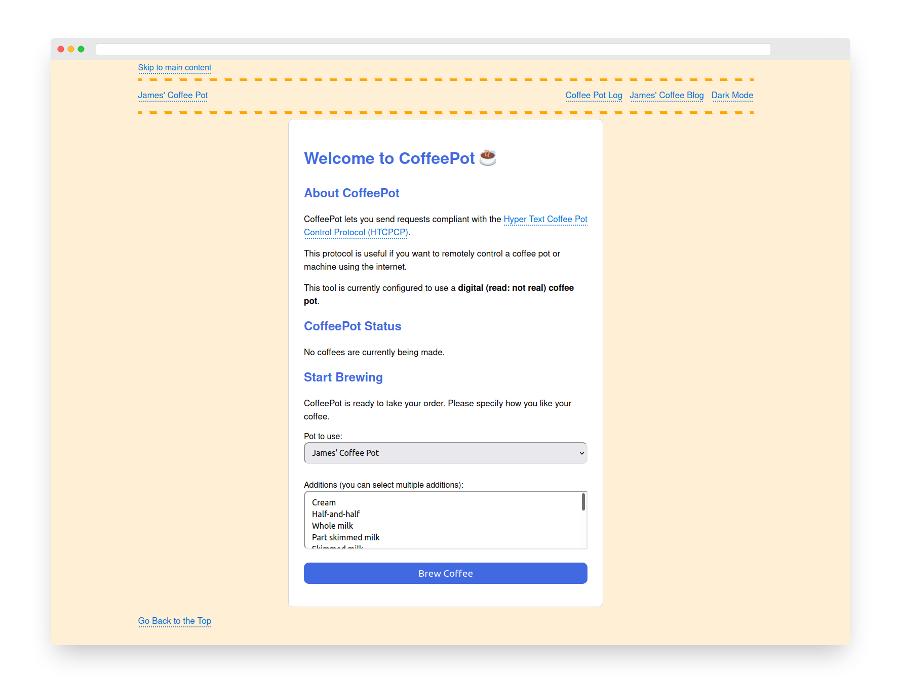

# James' Coffee Pot

James' Coffee Pot (also referred to as CoffeePot) is a server for coffee pot control.

The coffee pot server complies with the Hyper Text Coffee Pot Control Protocol (HTCPCP), a protocol defined in an IETF RFC memo.

This project contains two programs:

- A coffee pot server, accessible using the coffee:// URI scheme.
- A web interface that allows you to easily interact with the server.

The coffee pot has the ability to track coffees so that a coffee cannot be ordered when one is already brewing.

A live version of the coffee pot is available at [coffeepot.jamesg.blog](https://coffeepot.jamesg.blog).

## Screenshot

## Installation

To use this project, first install the required dependencies. You can do so with this command:

    pip install -r requirements.txt

Next, start the coffee pot server:

    python3 coffee.py

In a separate terminal, start the web interface for the coffee pot server:

    python3 app.py

After running the commands above, you are ready to start using the project.

Milk is poured in the coffee after five minutes of brewing. You can use the web application to send a WHEN request to stop pouring milk on demand.

## Alternative Milk Support

The coffee server can accept requests for almond, oat, soya, and coconut milk. While not defined in the original specification, these values have grown enough support among coffee drinkers to merit inclusion.

## HTTP 418 Status Code Support

The coffee pot does not support the HTTP 418 status code. This is because the application only allows you to define a coffee pot as a brewing device.

## Technologies

This project makes use of the following technologies:

- Python
- socket
- Flask

## License

This project is licensed under an [MIT license](LICENSE).

## Contributors

- capjamesg